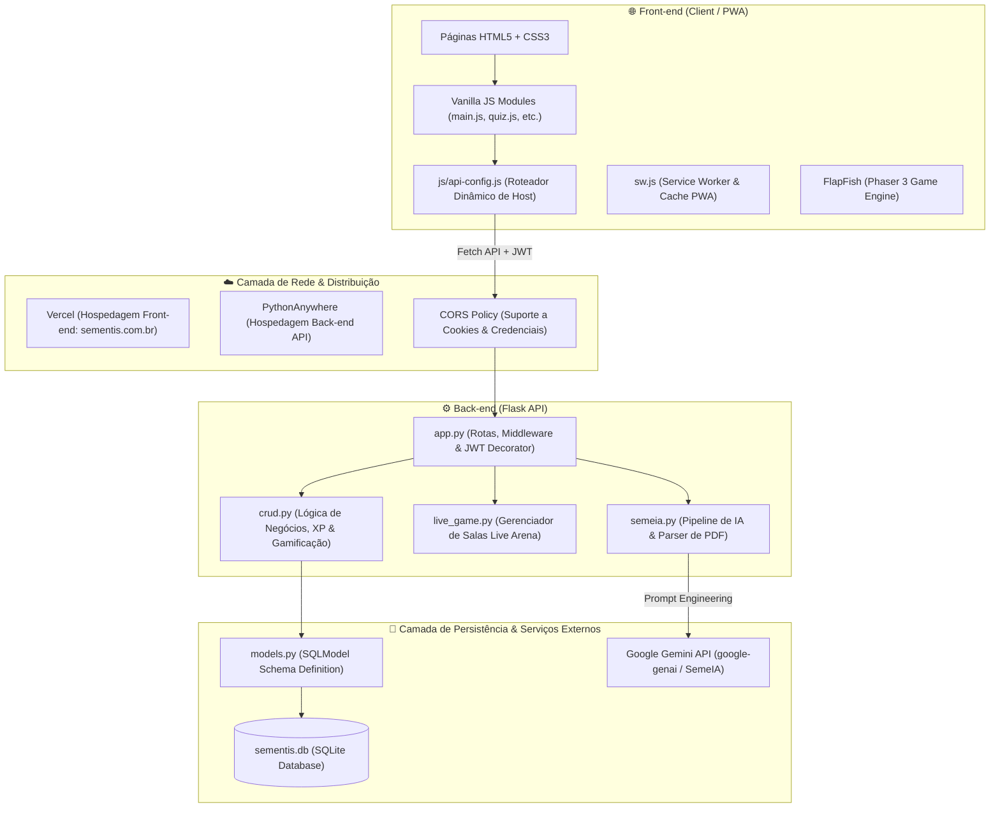
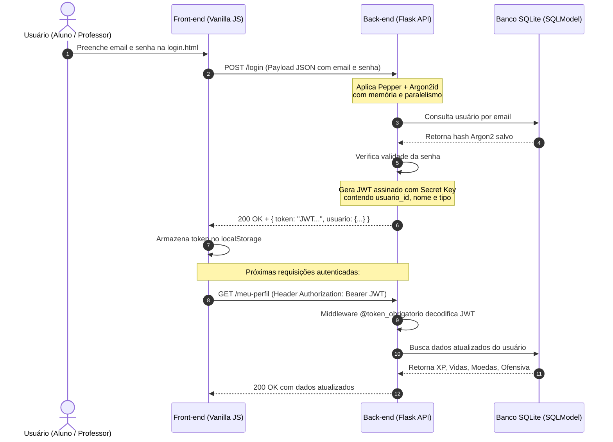

# Arquitetura Geral & Estrutura de Pastas 🏗️

O **Sementis** foi concebido sob uma **arquitetura desacoplada (Headless / Decoupled)**, onde o Front-end e o Back-end operam como serviços independentes, comunicando-se estritamente através de chamadas assíncronas via **REST API** com payloads JSON e autenticação via **JWT**.

---

## 📐 Visão Panorâmica da Arquitetura



---

## 🔄 Roteamento Dinâmico de Ambiente (`api-config.js`)

Uma das maiores dores de cabeça em aplicações desacopladas é alternar as URLs da API entre o ambiente local de desenvolvimento (`localhost:5000`) e a produção. O Sementis resolve isso de forma elegante através do [`js/api-config.js`](file:///d:/Programacao/Sementis-2/js/api-config.js).

Toda requisição feita no front-end utiliza a constante `API_BASE_URL`:
- Se a página estiver rodando em `localhost` ou `127.0.0.1`, ela aponta automaticamente para a API local: `http://127.0.0.1:5000`.
- Se estiver rodando na Vercel ou no domínio oficial, ela direciona para o servidor de produção no PythonAnywhere: `https://lucasperes.pythonanywhere.com`.

Isso permite que qualquer desenvolvedor clone o repositório, abra o front-end via extensão *Live Server* do VS Code e teste imediatamente sem alterar uma linha de código sequer.

---

## 📁 Mapa de Pastas e Principais Arquivos

Abaixo está o raio-x completo do repositório, explicando a responsabilidade de cada diretório e arquivo essencial:

```text
Sementis-2/
├── 📄 app.py                  # Ponto de entrada do Flask, configuração de CORS, JWT e rotas HTTP
├── 📄 crud.py                 # Funções de negócio do banco de dados (regras de XP, ofensiva, turmas)
├── 📄 models.py               # Definição das tabelas e esquemas de dados usando SQLModel
├── 📄 seeds.py                # Script de povoamento inicial do banco (módulos, trilhas, itens da loja)
├── 📄 semeia.py               # Integração com Google Gemini para geração automática de trilhas por IA
├── 📄 live_game.py            # Máquina de estados das salas multiplayer em tempo real do Live Arena
├── 📄 questoes.json           # Banco estático de perguntas com validações científicas e pedagógicas
├── 📄 sementis.db             # Banco de dados local SQLite
├── 📄 sw.js                   # Service Worker do PWA para controle de cache e funcionamento offline
│
├── 📁 js/                     # Scripts Vanilla JavaScript do front-end
│   ├── api-config.js          # Detecção de ambiente (Localhost vs Produção)
│   ├── auth.js                # Helpers para salvar, ler e validar tokens JWT no cliente
│   ├── main.js                # Script mestre da UI: barra de XP, vidas, modais e sincronização
│   ├── quiz.js                # Engine das trilhas de estudo: corações, layouts, feedback pedagógico
│   ├── sounds.js              # Efeitos sonoros interativos (SFX de acerto, erro, clique, vitória)
│   ├── shared-navbar.js       # Componente de barra de navegação unificada entre as páginas
│   ├── home.js                # Lógica da tela inicial do aluno e carregamento dos módulos
│   ├── arena.js               # Interface e polling do aluno no jogo ao vivo
│   ├── live-host.js           # Painel de controle do professor gerenciando o quiz ao vivo
│   ├── loja.js                # Catálogo de itens, compra e equipamento de avatares/temas
│   ├── missoes.js             # Tela de missões diárias e resgate de recompensas
│   ├── ligas.js               # Tabela de classificação semanal e transição de ligas
│   ├── painel-professor.js    # Dashboard principal do educador e métricas de turmas
│   ├── turma-professor.js     # Gestão individual da turma, alunos, avisos e download de CSV
│   └── turma-aluno.js         # Área da turma na perspectiva do estudante e mural
│
├── 📁 css/                    # Folhas de estilo modularizadas em CSS3 puro
│   ├── styles.css             # Variáveis CSS globais, reset e temas (cores das lixeiras, etc.)
│   ├── shared-navbar.css      # Estilização da navegação inferior e superior
│   ├── quiz.css               # Estilos para telas de perguntas, botões e modais de resultado
│   ├── painel-professor.css   # Layout do dashboard docente e formulários
│   ├── turma-professor.css    # Estilização do gerenciamento de turma e tabelas
│   ├── loja.css               # Grid de cosméticos, raridades e tags visuais
│   └── jogos.css              # Central arcade de jogos e animações em vídeo WebM
│
├── 📁 assets/                 # Recursos multimídia da aplicação
│   ├── webm/                  # Animações 3D ultraleves em formato WebM transparente
│   ├── sounds/                # Arquivos de áudio para feedbacks da gamificação
│   └── icons/                 # Ícones do PWA e da interface
│
├── 📁 FlapFish/               # Mini-game arcade educativo feito em Phaser 3
│   ├── index.html             # Ponto de entrada do jogo
│   ├── phaser.js              # Biblioteca Phaser 3 minificada
│   └── src/                   # Cenas do jogo (Preloader, Menu, Game, GameOver)
│
├── 📁 pwa/                    # Configurações do Progressive Web App
│   ├── manifest.webmanifest   # Metadados de instalação para Android, iOS e Desktop
│   └── pwa-register.js        # Script de registro do Service Worker
│
└── 📁 .github/                # Configurações de CI/CD, Skills e Agentes de IA
    ├── agents/                # Definição do esquadrão de agentes (SemeIA, CaIA, GratIA, etc.)
    └── skills/                # Capacidades especializadas do projeto
```

---

## 🔐 Segurança e Fluxo de Autenticação



1. **Hash com Argon2id + Pepper:** 
   Diferente de sistemas que usam algoritmos rápidos e vulneráveis como MD5 ou SHA256 puro, o Sementis utiliza **Argon2id** (vencedor da Password Hashing Competition) calibrado com parâmetros robustos (`memory_cost=65536` [64MB de RAM] e `parallelism=4`). Além disso, um `PEPPER` secreto armazenado apenas na memória do servidor é concatenado à senha, impedindo que vazamentos de banco exponham as senhas reais.
2. **Tokens JWT (JSON Web Tokens):**
   Utilizado para autenticação stateless em rotas protegidas através do decorador `@token_obrigatorio`. O token carrega a identificação do usuário e seu nível de acesso (`aluno` ou `professor`).
3. **Controle de Acesso Baseado em Função (RBAC):**
   Rotas sensíveis de professores (como criar turmas, atribuir trilhas ou invocar o gerador SemeIA) validam explicitamente se `request.usuario_tipo == 'professor'`.
