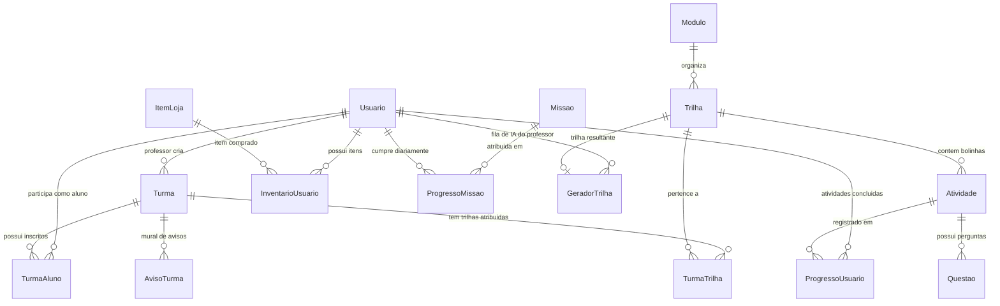

# Como Funciona o Back-end ⚙️

O back-end do Sementis foi arquitetado para ser **enxuto, previsível e altamente confiável**. Ele é construído em **Python** utilizando **Flask** para a camada de controle/rotas e **SQLModel** (que combina SQLAlchemy com Pydantic) para a camada de modelo e persistência de dados.

---

## 🛠️ Tecnologias e Bibliotecas Principais

* **Flask:** Microframework web encarregado de receber requisições HTTP, despachar rotas e gerenciar respostas JSON.
* **Flask-CORS:** Configuração de permissões de origem cruzada para aceitar requisições do front-end na Vercel com suporte a credenciais.
* **SQLModel & SQLite:** ORM declarativo tipado que mapeia as classes Python diretamente para o banco SQLite local (`sementis.db`).
* **Argon2 (passlib):** Algoritmo resistente a ataques de força bruta e memória (Memory-Hard) para o hashing de credenciais de usuários.
* **PyJWT:** Geração e validação de tokens de autenticação criptografados.
* **Google Gemini API (`google-genai`):** Motor de IA generativa integrado no módulo **SemeIA** para criação inteligente de trilhas pedagógicas.

---

## 📊 Modelo de Dados (`models.py`)

Todo e qualquer acesso aos dados do Sementis segue a convenção estrita de utilizar os modelos definidos em [`models.py`](file:///d:/Programacao/Sementis-2/models.py). Não são utilizados comandos SQL puros.

### Diagrama Entidade-Relacionamento (ER)

### Principais Entidades e Atributos

1. **`Usuario`**:
   * Armazena dados de acesso (`email`, `senha`), tipo (`aluno` ou `professor`) e métricas da gamificação: `xp`, `xp_semanal`, `ofensiva` (streak), `vidas`, `moedas` (sementes), `freezes` (bloqueios de perda de streak) e a `liga_id`.
   * Campos de IA: `trilhas_ia_restantes` e `trilhas_ia_plano_pro`.
2. **`Modulo`, `Trilha` e `Atividade`**:
   * Hierarquia pedagógica: **Módulo** (ex: *Recursos Hídricos*) ➔ **Trilhas** (ex: *Ciclo da Água*, *Poluição dos Rios*) ➔ **Atividades** (cada uma das bolinhas clicáveis que representam leituras, quizzes ou minigames).
3. **`Questao`**:
   * Vinculada a uma `Atividade`. Armazena o tipo de tela (`tipo_layout`) e o JSON completo (`conteudo`) contendo enunciado, alternativas, justificativa pedagógica e links de fontes oficiais.
4. **`Turma`, `TurmaAluno` e `TurmaTrilha`**:
   * Gerenciamento escolar: turmas geram um `codigo_convite` alfanumérico único para os alunos entrarem. Professores podem atribuir trilhas específicas às turmas e acompanhar o avanço dos estudantes.
5. **`Missao` e `ProgressoMissao`**:
   * Mecânica de missões diárias com cotas (ex: "Acerte 5 perguntas hoje"). O sistema renova o progresso diariamente com base no campo `data_missao`.
6. **`ItemLoja` e `InventarioUsuario`**:
   * Catálogo de avatares, temas e consumíveis com raridades (`comum`, `raro`, `epico`, `lendario`) e atributos bônus.

---

## 🧠 Regras de Negócio e Gamificação (`crud.py`)

O arquivo [`crud.py`](file:///d:/Programacao/Sementis-2/crud.py) é o motor da inteligência de dados do Sementis. Uma das regras inegociáveis do projeto é:

> **Regra de Ouro:** O Front-end NUNCA deve calcular regras de negócio pesadas (como XP, dias de ofensiva ou nível). O back-end calcula, aplica as travas de integridade no banco e entrega o resultado final consolidado.

### 1. Sistema de Nível e XP
O nível do aluno é calculado através de uma progressão quadrática que premia a consistência:
$$\text{Nível} = \left\lfloor \frac{\sqrt{\text{XP}}}{10} \right\rfloor + 1$$
Ao concluir lições, o back-end incrementa o XP total e o `xp_semanal` (utilizado nas ligas de domingo).

### 2. Ofensiva Diária (Streak) & Proteção por Freeze
A função `atualizar_ofensiva(usuario_id)` verifica a data da `ultima_atividade`:
* **Atividade no mesmo dia:** Não altera o contador, apenas confirma a presença.
* **Atividade no dia seguinte consecutivo:** Incrementa a ofensiva (`ofensiva += 1`).
* **Intervalo de mais de 1 dia:**
  * Se o usuário possuir um item de **Congelamento de Ofensiva (Freeze)** no inventário, o sistema consome automaticamente um freeze e preserva o streak!
  * Se não possuir freezes disponíveis, o streak é resetado para `1`.

### 3. Sorteio de Missões Diárias
A função `sortear_missoes_diarias(usuario_id)` verifica se o aluno já possui missões geradas para a data atual (`date.today()`). Se não tiver, sorteia automaticamente 3 desafios de naturezas distintas do catálogo e prepara a barra de progresso individual.

---

## 🚀 Camada de Controle e Endpoints (`app.py`)

O arquivo [`app.py`](file:///d:/Programacao/Sementis-2/app.py) expõe os serviços RESTful consumidos pelo front-end:

### Principais Grupos de Rotas

| Domínio | Método & Rota | Proteção | Descrição |
| :--- | :--- | :---: | :--- |
| **Autenticação** | `POST /cadastro` | Aberta | Criação de conta com hashing Argon2id |
| | `POST /login` | Aberta | Emissão de token JWT assinado |
| **Perfil & Aluno** | `GET /meu-perfil` | `@token_obrigatorio` | Retorna status do aluno, XP, avatar e ofensiva |
| | `POST /concluir-atividade` | `@token_obrigatorio` | Registra progresso, concede XP e atualiza streak |
| **Trilhas & Quiz** | `GET /modulos` | Aberta | Lista todos os módulos pedagógicos |
| | `GET /trilhas/<id>` | Aberta | Retorna as atividades sequenciais de uma trilha |
| | `GET /questoes/atividade/<id>` | Aberta | Fornece perguntas formatadas para o quiz engine |
| **Loja & Economia** | `GET /loja/itens` | Aberta | Vitrine de avatares e itens cosméticos |
| | `POST /loja/comprar` | `@token_obrigatorio` | Validação de saldo e inserção no inventário |
| | `POST /loja/equipar` | `@token_obrigatorio` | Define avatar ou tema ativo do perfil |
| **Gestão Docente** | `GET /turmas` | `@token_obrigatorio` | Lista turmas associadas ao professor |
| | `POST /turmas` | `@token_obrigatorio` | Criação de turma com código de 6 caracteres |
| | `GET /turmas/<id>/relatorio-csv`| `@token_obrigatorio` | Exportação de planilha de engajamento escolar |
| **IA SemeIA** | `POST /semeia/gerar-trilha` | `@token_obrigatorio` | Envia solicitação de geração inteligente via IA |
| | `GET /semeia/status/<job_id>` | `@token_obrigatorio` | Consulta assíncrona do status de geração |

---

## 🤖 Geração de Conteúdo com IA (`semeia.py`)

O **SemeIA** é o módulo de inteligência pedagógica do Sementis alimentado pelo modelo **Google Gemini**:

1. **Ingestão de Conteúdo:** O professor pode fornecer um tema em texto (ex: *"Energias Renováveis na Matriz Brasileira"*) ou realizar o upload de um arquivo PDF pedagógico.
2. **Moderação e Sanitização:** O sistema valida o tamanho do arquivo (`LIMITE_PDF_BYTES = 5MB`) e rejeita termos que firam as diretrizes acadêmicas.
3. **Engenharia de Prompt Estruturada:** O Gemini é instruído a agir como um pedagogo especialista em BNCC (Base Nacional Comum Curricular), devolvendo uma estrutura rígida contendo nome da trilha, descrição e uma série de atividades e questões com opções, gabarito e fontes pedagógicas confiáveis.
4. **Processamento Assíncrono com Cotas:** Para garantir a disponibilidade do servidor sem travamento da thread principal, a geração roda em background associada à tabela `GeradorTrilha`, decrementando a cota mensal do professor (`trilhas_ia_restantes`).
