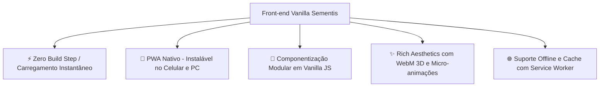

# Como Funciona o Front-end 💻

O front-end do **Sementis** adota uma filosofia de desenvolvimento moderna, veloz e descomplicada: **Vanilla Web** (HTML5 semântico, CSS3 puro e JavaScript moderno ES6+). Não há frameworks pesados (como React, Angular ou Vue) nem pipelines complexos de compilação (Webpack, Vite). O código roda nativamente em qualquer navegador moderno com máxima performance e tempo de carregamento quase instantâneo.

---

## 🎨 Filosofia e Pilares do Front-end

1. **Simplicidade e Sustentabilidade de Código:** Menos dependências significam menor risco de quebra por atualizações, menor consumo de rede e facilidade para qualquer aluno ou professor inspecionar o código fonte.
2. **Progressive Web App (PWA):** O projeto possui Manifesto Web (`manifest.webmanifest`) e Service Worker (`sw.js`). Ele pode ser instalado diretamente na tela inicial do Android, iOS ou Windows como se fosse um app nativo da loja.
3. **Estética Rica (Rich Aesthetics):** Cores vivas baseadas em paletas de sustentabilidade (tons de verde esmeralda, azul hídrico e acentos solares), fontes modernas (Google Fonts *Poppins*), modais com efeito de vidro fosco (*Glassmorphism*) e vídeos ultraleves em formato **WebM transparente** (`assets/webm/`).

---

## 🧠 Scripts Centrais e Arquitetura do Cliente

Toda a interação do front-end é orquestrada por uma suíte de utilitários em [`js/`](file:///d:/Programacao/Sementis-2/js):

### 1. Roteamento de API (`api-config.js`)
Configura a base de todas as chamadas HTTP. Detecta se a página está rodando em `localhost:5000` (desenvolvimento) ou no domínio da nuvem e exporta a variável global `API_BASE_URL`.

### 2. Autenticação e Sessão (`auth.js`)
Gerencia o ciclo de vida do token de acesso:
* Armazena o JWT no `localStorage`.
* Anexa o cabeçalho `Authorization: Bearer <TOKEN>` automaticamente nas chamadas protegidas.
* Monitora respostas `401 Unauthorized` e redireciona o usuário expirado para a tela de login.

### 3. Orquestrador de Interface (`main.js`)
É o coração visual da aplicação. Roda em quase todas as páginas do aluno para:
* Executar a função global `atualizarBarraDeXP()` que busca os dados atualizados de XP, moedas, vidas e ofensiva direto do back-end.
* Exibir notificações dinâmicas na tela (*toasts* animados de sucesso, erro e aviso).
* Controlar modais de nível, de perda de vidas e confirmações de ações.

### 4. Componentização: A Navbar Compartilhada (`shared-navbar.js`)
Sem frameworks, como manter a barra de navegação unificada em 10 telas diferentes?
* Criamos o script [`js/shared-navbar.js`](file:///d:/Programacao/Sementis-2/js/shared-navbar.js), que procura pela tag `

`.
* O script injeta o HTML da barra inferior com ícones SVG modernos, detecta a página atual via `window.location.pathname` e adiciona a classe `.active` automaticamente no botão correspondente (Início, Trilhas, Missões, Loja ou Perfil).

### 5. Motor de Efeitos Sonoros (`sounds.js`)
Para garantir uma sensação tátil de jogo (*gameloop feedback*), o script de sons utiliza áudios curtos sintetizados para tocar nos momentos chave:
* `playSuccess()` — Quando o aluno acerta uma questão no quiz.
* `playError()` — Quando erra uma resposta e perde um coração.
* `playClick()` — Clique de botões e seleção de menus.
* `playLevelUp()` — Explosão de confetes e promoção de nível.

---

## 📱 Mapa de Telas e Controladores

### 🟢 Área do Aluno

| Página HTML | Controlador JS | Estilo CSS | Finalidade |
| :--- | :--- | :--- | :--- |
| `index.html` | — | `styles.css` | Landing page de apresentação institucional do Sementis. |
| `login.html` | `login.js`, `cadastro.js` | `styles.css` | Telas de autenticação com validação de campos em tempo real. |
| `home.html` | `home.js` | `home.css` | Dashboard principal com seleção de módulos pedagógicos. |
| `trilhas.html` | `quiz.js` | `quiz.css` | O caminho de atividades e o motor do Quiz interativo com corações. |
| `jogos.html` | — | `jogos.css` | Central de jogos arcade (Sementis Live, Flappy Fish e Reciclagem). |
| `missions.html` | `missoes.js` | `missoes.css` | Lista de 3 missões diárias com barra de progresso e resgate de moedas. |
| `loja.html` | `loja.js` | `loja.css` | Loja com abas de Avatares, Temas e Vantagens (Freezes e Vidas). |
| `ligas.html` | `ligas.js` | `ligas.css` | Tabela de classificação semanal com zona de promoção e rebaixamento. |
| `turma-aluno.html`| `turma-aluno.js` | `turma-aluno.css` | Mural de avisos da turma e ranking interno dos colegas de classe. |
| `perfil.html` | `perfil.js` | `styles.css` | Estatísticas gerais do aluno, conquistas e histórico de atividade. |

---

### 🔵 Área do Educador (Painel Docente)

| Página HTML | Controlador JS | Estilo CSS | Finalidade |
| :--- | :--- | :--- | :--- |
| `painel-professor.html` | `painel-professor.js` | `painel-professor.css` | Visão geral das turmas, criação de salas e acesso ao gerador **SemeIA**. |
| `turma-professor.html` | `turma-professor.js` | `turma-professor.css` | Detalhes da turma: código de convite, atribuição de trilhas, alunos e mural. |
| `live-host.html` | `live-host.js` | `arena.css` | Painel do host para projetar o quiz estilo Kahoot na sala de aula. |

---

## ⚡ Estratégia PWA e Funcionamento Offline (`sw.js`)

O Service Worker do Sementis adota a estratégia **Cache-First com Network Fallback** para arquivos estáticos:
* Fontes do Google Fonts (`Poppins`), folhas de estilo CSS, sons e ícones são gravados no cache do navegador.
* Quando o usuário navega sem conexão de internet estável, o layout é carregado instantaneamente.
* As rotas de API (`/api/`) utilizam **Network-Only** para garantir que dados de saldo, pontuação e progresso nunca sejam exibidos defasados.
