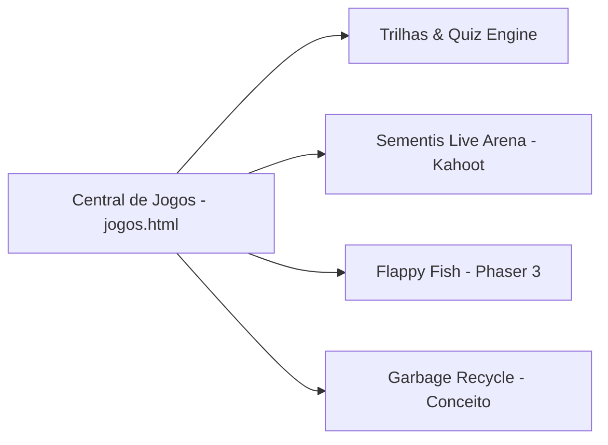
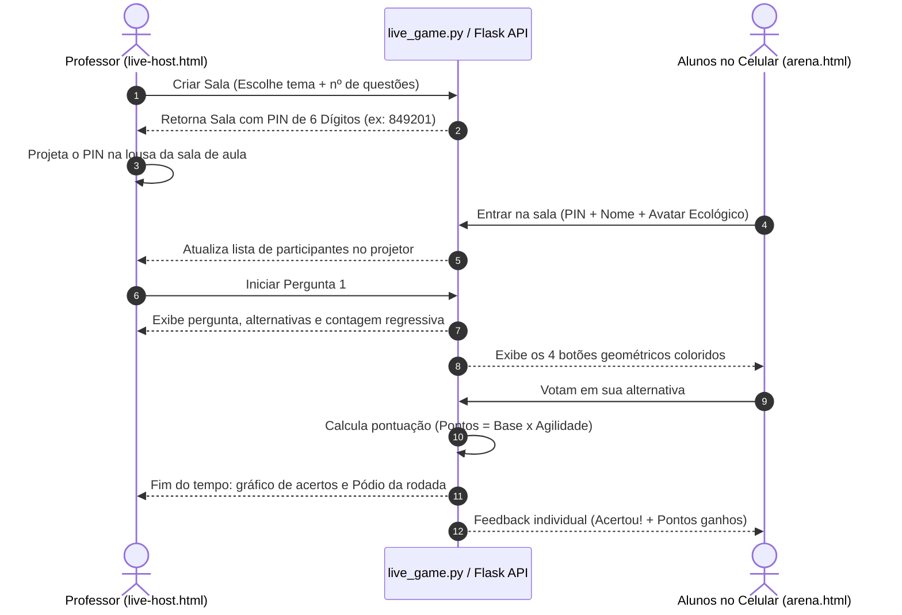

# Os Games em JS e Interatividade 🎮

O Sementis transforma conceitos de sustentabilidade em experiências interativas através de múltiplos jogos em JavaScript, que vão desde um motor de quiz pedagógico com sistema de vidas até um jogo arcade 2D construído em **Phaser 3** e uma arena multiplayer estilo *Kahoot!*.

---

## 🕹️ A Central de Jogos (`jogos.html`)

A Central de Jogos serve como o *lobby* arcade do ecossistema. Desenvolvida com cartões interativos dinâmicos, traz animações com vídeos em loop com fundo transparente WebM e organiza os diferentes modos de jogo disponíveis para o estudante.



---

## 1. O Quiz Engine das Trilhas (`quiz.js` & `trilhas.html`)

O motor de trilhas pedagógicas do Sementis é inspirado no fluxo de aprendizado do **Duolingo**, combinando desafios rápidos, reforço positivo e penalidades leves para engajar o aluno.

### 💖 Mecânica de Vidas e Corações
* O estudante inicia cada lição com **5 vidas** (corações).
* A cada resposta incorreta, um coração é consumido com uma animação de quebra e som característico (`playError()`).
* Se os 5 corações se esgotarem, a tela de **Game Over** é disparada, permitindo que o aluno tente novamente ou visite a loja para repor suas vidas com sementes.

### 🔀 Embaralhamento Antidecoreba
Para evitar que os alunos simplesmente memorizem a posição física dos botões (ex: "é sempre a letra B"):
```javascript
// Funções de embaralhamento dinâmico em js/quiz.js
function shuffleArray(items) {
  const arr = [...items];
  for (let i = arr.length - 1; i > 0; i--) {
    const j = Math.floor(Math.random() * (i + 1));
    [arr[i], arr[j]] = [arr[j], arr[i]];
  }
  return arr;
}
```
As opções de resposta de cada questão são aleatorizadas a cada tentativa, exigindo que o estudante leia com atenção o conteúdo.

### 📖 Justificativas e Fontes Pedagógicas Oficiais
Um dos diferenciais do Sementis é que o erro faz parte do aprendizado. Ao responder uma pergunta, o sistema abre uma gaveta inferior exibindo:
1. **Explicação:** Por que aquela é a resposta correta.
2. **Fonte Oficial Confiável:** Um link clicável para artigos e relatórios de órgãos científicos de referência (ex: ANA, MMA, Embrapa, ONU Meio Ambiente).

---

## 2. Sementis Live Arena — O Kahoot da Sustentabilidade 🏟️

O **Sementis Live Arena** é a ferramenta ideal para dinamizar aulas presenciais ou palestras. Ele permite que o professor projete um quiz em tempo real na lousa enquanto dezenas de alunos competem pelo celular.

### Arquitetura de Comunicação da Sala



### Formas Geométricas & Acessibilidade
Para facilitar a visualização mesmo em projetores de baixa resolução ou para estudantes com daltonismo, as 4 alternativas associam cores a formas geométricas distintas:

| Símbolo | Forma | Cor | Tema Ecológico |
| :---: | :---: | :---: | :---: |
| **▲** | Triângulo | Vermelho (`#ef4444`) | Solo e Terra |
| **◆** | Losango | Azul (`#3b82f6`) | Recursos Hídricos |
| **●** | Círculo | Amarelo (`#f59e0b`) | Energia Solar |
| **■** | Quadrado | Verde (`#10b981`) | Flora e Florestas |

Na tela do aluno em [`arena.html`](file:///d:/Programacao/Sementis-2/arena.html), apenas os 4 grandes botões táteis são exibidos, tornando a resposta ultrarrápida no celular.

---

## 3. Flappy Fish (`FlapFish/`) 🐟

O **Flappy Fish** é um minigame arcade educativo desenvolvido inteiramente com a biblioteca de jogos **Phaser 3**.

### Proposta Pedagógica do Jogo
O jogador controla um peixinho que nada pelo leito de um rio e precisa desviar de garrafas plásticas, canudos e redes de pesca descartadas que poluem as águas. Cada obstáculo superado representa a preservação do habitat marinho.

### Estrutura das Cenas Phaser (`FlapFish/src/scenes/`)

```text
FlapFish/src/
├── main.js             # Configuração da Game Engine, física Arcade e resolução
└── scenes/
    ├── Preloader.js    # Carregamento de spritesheets, backgrounds e áudios
    ├── Menu.js         # Tela inicial, high scores e botão de iniciar
    ├── Game.js         # Loop principal de física, gravidade aquática e colisão
    └── GameOver.js     # Tela de fim de jogo com estatísticas e mensagem de conscientização
```

### Trecho Chave do Loop de Física (`Game.js`)
O peixe sofre influência contínua da gravidade dentro da água. O clique do mouse ou toque na tela aplica um impulso vertical para cima:
```javascript
// Impulso natatório ao tocar na tela
this.input.on('pointerdown', () => {
    this.player.setVelocityY(-250); // Nada para cima
    this.player.setAngle(-20);      // Inclina a cabeça do peixe para cima
});
```
Se o peixe colidir com qualquer resíduo plástico, o evento `collider` dispara a transição para a cena de `GameOver`, exibindo dados sobre o tempo de decomposição do plástico nos oceanos.

---

## 4. Garbage Recycle (Conceito de Separação de Lixo) ♻️

Projetado como um minigame de agilidade mental onde diferentes resíduos (cascas de fruta, latinhas de alumínio, garrafas PET, jornais velhos) caem pela tela e o jogador deve arrastá-los ou direcioná-los para as lixeiras corretas antes que o cronômetro zere:
* 🔵 **Lixeira Azul:** Papel e Papelão
* 🔴 **Lixeira Vermelha:** Plástico
* 🟡 **Lixeira Amarela:** Metal
* 🟢 **Lixeira Verde:** Vidro
* 🟤 **Lixeira Marrom:** Resíduos Orgânicos
