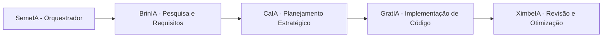

# Guia de Contribuição e Execução Local 🚀

Este guia é voltado para desenvolvedores, professores ou membros da comunidade acadêmica que desejam clonar o repositório, executar a aplicação localmente e contribuir com novas funcionalidades ou trilhas pedagógicas.

---

## 💻 Como Rodar o Projeto Localmente

Como a aplicação possui uma arquitetura desacoplada, o processo envolve iniciar o servidor da API (Python/Flask) e servir a interface web (Front-end).

### 1. Pré-requisitos
* **Python 3.10 ou superior** instalado.
* **Git** instalado.
* **VS Code** (recomendado, com a extensão **Live Server**).

---

### 2. Passo a Passo: Back-end (API)

1. Clone o repositório em sua máquina:
   ```bash
   git clone https://github.com/PHenrique07/Sementis-IFSP-Pirituba.git
   cd Sementis-IFSP-Pirituba
   ```

2. Crie e ative o ambiente virtual:
   * **Windows (PowerShell):**
     ```powershell
     python -m venv venv
     .\venv\Scripts\Activate.ps1
     ```
   * **Linux / macOS:**
     ```bash
     python3 -m venv venv
     source venv/bin/activate
     ```

3. Instale as dependências:
   ```bash
   pip install -r requirements.txt
   ```

4. Crie e popule o banco de dados inicial com dados de teste:
   ```bash
   python seeds.py
   ```
   *(Este comando criará o arquivo `sementis.db` e registrará módulos, trilhas, itens da loja, turmas e missões padrão).*

5. Inicie o servidor Flask:
   ```bash
   python app.py
   # ou
   flask run
   ```
   *A API estará acessível em: `http://127.0.0.1:5000`.*

---

### 3. Passo a Passo: Front-end (Cliente)

1. Com o servidor Flask rodando no terminal, abra a pasta do projeto no VS Code.
2. Localize o arquivo `index.html` na raiz do projeto.
3. Clique com o botão direito em `index.html` e selecione **"Open with Live Server"** (ou abra em `http://localhost:5500` / `http://localhost:3000`).
4. **Mágica da detecção de ambiente:** O arquivo [`js/api-config.js`](file:///d:/Programacao/Sementis-2/js/api-config.js) detectará automaticamente que o host é `localhost` e fará todas as chamadas `fetch()` apontarem para a sua API local na porta 5000.

---

## 🛡️ Convenções e Regras Inegociáveis do Projeto

Para manter a consistência e a facilidade de manutenção por qualquer membro da equipe, todo o código do repositório deve respeitar as seguintes regras:

1. **Mimetismo de Código (Não invente):**
   Siga estritamente os padrões existentes no repositório. Não adicione bibliotecas pesadas de terceiros (Tailwind, React, Redux) nem mude a estrutura estabelecida.
2. **Modelagem via SQLModel:**
   Qualquer alteração estrutural no banco de dados DEVE ser feita adicionando ou modificando classes no [`models.py`](file:///d:/Programacao/Sementis-2/models.py). Não execute comandos SQL manuais (*raw SQL*).
3. **Separação Rígida de Responsabilidades:**
   O front-end **nunca** calcula saldo de moedas, promoção de ligas ou ofensiva. O front envia a ação via API, o back-end processa e valida as regras de negócio, e o front apenas exibe o retorno.
4. **Nomenclatura em Português:**
   Variáveis, métodos e comentários de regras de negócio devem ser escritos prioritariamente em Português (ex: `atualizar_ofensiva`, `buscar_ranking_por_liga`, `concluir_atividade`).

---

## 🤖 O Esquadrão Sementis (Pipeline de Agentes)

No desenvolvimento do projeto com Inteligência Artificial, seguimos o pipeline de papéis especializados:



* **SemeIA:** Avalia se uma demanda é uma correção rápida (*Fast Path*) ou uma funcionalidade complexa (*Full Pipeline*).
* **BrinIA:** Especialista em pesquisa que documenta os requisitos pedagógicos e técnicos sem alterar código.
* **CaIA:** Arquiteta de soluções que desenha contratos de dados (payloads) e arquitetura de módulos.
* **GratIA:** Especialista em implementação prática que escreve o código funcional em Flask + Vanilla JS.
* **XimbeIA:** Revisora rigorosa que remove redundâncias, melhora a legibilidade e garante o cumprimento das convenções do projeto.
