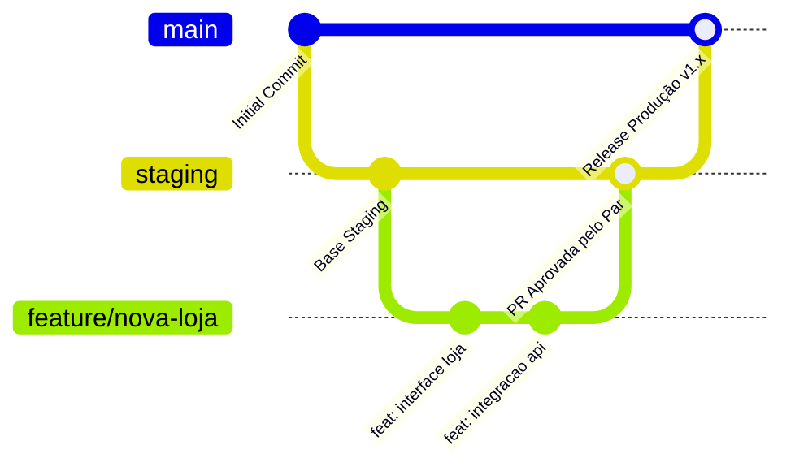
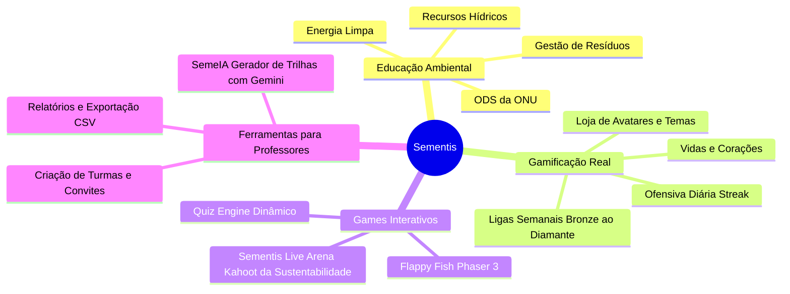

# Bem-vindo à Wiki do Sementis 🌱

> *"Se você está lendo isso, ou você é um membro novo do Sementis (o que é muito difícil kkkkkkk), um professor curioso para ver como a plataforma funciona por dentro, ou um estudante que caiu de paraquedas neste repositório para pegar inspiração pro seu próprio projeto... Seja muito bem-vindo"*

---

## 🧭 O que é o Sementis?

O **Sementis** é uma plataforma educacional gamificada e interativa voltada para a conscientização ambiental e o ensino prático de sustentabilidade, nascida como projeto de extensão no **Instituto Federal de São Paulo (IFSP) — Campus Pirituba**.

A ideia central do projeto é combater a monotonia do ensino teórico tradicional de ecologia. Ao invés de apenas ler apostilas sobre reciclagem e recursos hídricos, os estudantes vivenciam uma experiência parecida com jogos como **Duolingo** e **Kahoot!**, combinada com mecânicas de RPG (XP, níveis, ofensivas diárias, ligas competitivas e uma loja de avatares colecionáveis).

Além disso, o Sementis oferece um ecossistema completo para educadores, incluindo geração de trilhas com Inteligência Artificial (**SemeIA**), murais de recados, gestão de turmas e relatórios pedagógicos de desempenho.

---

## 👥 Como o Time Trabalha (Engenharia & Cultura)

Se você acabou de cair aqui no time ou está avaliando nosso projeto, entender como a gente se organiza é fundamental. Nossa equipe é dividida estrategicamente no modelo **2 Back-end e 2 Front-end**, garantindo foco total em cada ponta do sistema:

### A Divisão dos Papéis
* 🛠️ **Pedro Henrique (Líder Técnico & Banco de Dados):** Coordenação geral técnica da equipe, arquitetura e modelagem do banco de dados ([`models.py`](file:///d:/Programacao/Sementis-2/models.py)), motor de regras de negócio, fórmulas de XP, ofensiva diária e persistência de dados ([`crud.py`](file:///d:/Programacao/Sementis-2/crud.py)) e scripts de povoamento ([`seeds.py`](file:///d:/Programacao/Sementis-2/seeds.py)).
* ⚙️ **Lucas Peres (Back-end & API):** Estruturação do servidor web, implementação das rotas RESTful no [`app.py`](file:///d:/Programacao/Sementis-2/app.py), segurança e autenticação (JWT e hashing Argon2id), configuração de CORS para a Vercel e suporte a endpoints externos.
* ⚡ **Vinícius Ruza (JavaScript & Phaser Engine):** Arquitetura de consumo assíncrono de API, controle do Quiz Engine das trilhas ([`js/quiz.js`](file:///d:/Programacao/Sementis-2/js/quiz.js)), mecânica de game loop, pontuação e desenvolvimento dos jogos em **Phaser 3** ([`FlapFish/`](file:///d:/Programacao/Sementis-2/FlapFish)).
* 🎨 **Wellington Mendes / "Tom" (UI/UX & Front-end):** Concepção da identidade visual do Sementis, design de interfaces, estilização com CSS3 puro modular ([`css/`](file:///d:/Programacao/Sementis-2/css)), responsividade mobile-first, micro-animações e implementação dos layouts HTML semânticos.

---

## 🔄 Fluxo de Desenvolvimento e Git Workflow

Adotamos boas práticas rigorosas de engenharia para manter a estabilidade do produto em produção:

1. **Staging Primeiro, Main Depois:** 
   Ninguém faz commit direto na branch `main`. Todo desenvolvimento de novas features e correções ocorre em branches dedicadas (`feature/...` ou `fix/...`) e são mescladas inicialmente na branch **`staging`**. Apenas após testes de integração rigorosos a `staging` é promovida para a `main`.
2. **Revisão por Pares (Peer Review Obrigatório):**
   Toda alteração de código entra via **Pull Request (PR)** e requer aprovação mandatória do respectivo **par de área**:
   * *Back-end revisa Back-end:* Pedro e Lucas revisam os PRs de rotas, banco e regras de negócio.
   * *Front-end revisa Front-end:* Vini e Tom revisam os PRs de scripts JS, UI e CSS.
3. **Gestão Ágil no GitHub Projects:**
   Não trabalhamos no escuro. Nossas demandas são quebradas em cards objetivos e organizadas nas colunas do quadro Kanban do GitHub Projects (*Todo*, *In Progress*, *Review*, *Done*).
4. **Weekly Semanal:**
   Toda semana a equipe realiza uma reunião de alinhamento (*Weekly*) para:
   * Discutir impasses técnicos e aprendizados da semana anterior.
   * Priorizar e criar os novos cards da sprint no GitHub Projects.
   * Testar juntos as versões consolidadas em `staging`.

---

## 🧰 Resumo Rápido da Stack Tecnológica

* **Back-end:** Python 3.10+, Flask (API REST), SQLModel (ORM sobre SQLAlchemy) e SQLite (`sementis.db`).
* **Segurança:** Argon2id (hashing de senhas com memória de 64MB e paralelismo + Pepper) e PyJWT (sessões stateless seguras).
* **Inteligência Artificial:** Google Gemini API via SDK oficial (`google-genai`), acionado pelo módulo **SemeIA** para criação automática de trilhas por professores.
* **Front-end:** HTML5 Semântico, CSS3 Moderno (Vanilla) e JavaScript Puro (ES6+). Zero frameworks pesados, zero bundlers obrigatórios, carregamento instantâneo.
* **Jogos & Interatividade:** Phaser 3 para o arcade *Flappy Fish* e *Quiz Engine* nativo para as trilhas de aprendizado e o *Sementis Live Arena* (multiplayer via PIN).
* **Distribuição & PWA:** PWA com Manifesto e Service Worker (`sw.js`). Front-end hospedado na **Vercel** (`sementis.com.br`) e API no **PythonAnywhere**, com chaveamento automático de ambiente via [`js/api-config.js`](file:///d:/Programacao/Sementis-2/js/api-config.js).

---

## 🎯 Pilares Pedagógicos e Gamificação

* **Gamificação Profunda:** Nada de pontos fictícios sem utilidade. O aluno perde corações/vidas ao errar, tem incentivo diário para não quebrar a ofensiva (*streak*), sobe de divisão nas ligas aos domingos e acumula "Sementes" para destravar itens estéticos.
* **Pedagogia Transparente:** Todas as questões trazem justificativas pedagógicas detalhadas com links oficiais de órgãos como Ministério do Meio Ambiente, ANA, ONU e Embrapa.
* **Inclusão Escolar:** Funciona de forma ultraleve em celulares antigos ou redes instáveis graças à arquitetura Vanilla PWA.

---

## 👥 A Experiência em Dois Papéis (Aluno vs Professor)

| Funcionalidade | Visão Aluno 🌱 | Visão Professor 👨‍🏫 |
| :--- | :---: | :---: |
| **Trilhas de Aprendizado** | Joga as lições, perde vidas e ganha XP | Atribui trilhas de estudo às suas turmas |
| **Central de Jogos** | Joga Flappy Fish, Quiz e disputa na Arena | Cria e comanda salas do Sementis Live Arena |
| **Missões Diárias** | Recebe 3 missões por dia com reset à meia-noite | Acompanha métricas de dedicação dos alunos |
| **Ligas e Ranking** | Disputa promoção de liga semanalmente | Visualiza ranking interno fechado da turma |
| **Loja e Inventário** | Adquire avatares, temas e congelamentos | Acesso livre às ferramentas da plataforma |
| **Gestão de Turmas** | Entra em turmas via código de convite de 6 dígitos | Cria turmas, remove alunos e gera relatórios CSV |
| **Mural de Avisos** | Lê recados publicados pelo professor | Publica comunicados oficiais com data e hora |
| **SemeIA (IA)** | Consome os conteúdos gerados | Cria trilhas completas a partir de temas ou PDFs |

---

## 📚 Índice da Documentação da Wiki

Navegue pelos capítulos técnicos detalhados da documentação:

1. **[01. Onboarding e Visão Geral (Esta Página)](./Home.md)** — Contexto, cultura do time, fluxo de PRs e papéis.
2. **[02. Arquitetura Geral & Estrutura de Pastas](./02-arquitetura-geral.md)** — Como o front-end, o back-end e o banco de dados se comunicam, e o propósito de cada arquivo do repositório.
3. **[03. Como Funciona o Back-end](./03-backend.md)** — Flask, SQLModel, regras de negócio no `crud.py`, autenticação Argon2id/JWT e IA no `semeia.py`.
4. **[04. Como Funciona o Front-end](./04-frontend.md)** — Arquitetura Vanilla JS, PWA, estilos modulares em CSS, gerenciamento global de estado e consumo de API.
5. **[05. Os Games em JS e Interatividade](./05-games-js.md)** — Quiz Engine interativo, Sementis Live Arena (Kahoot multiplayer) e Flappy Fish em Phaser 3.
6. **[06. Guia de Contribuição e Execução Local](./06-guia-de-contribuicao.md)** — Como clonar, rodar o ambiente de desenvolvimento e padrões de código seguidos pelo time.

---

*Aproveite a leitura da wiki! Se você veio se inspirar, sinta-se à vontade para explorar nosso código e arquitetura.*
*SE COPIAR HAVERÁ CONSEQUENCIAS*
